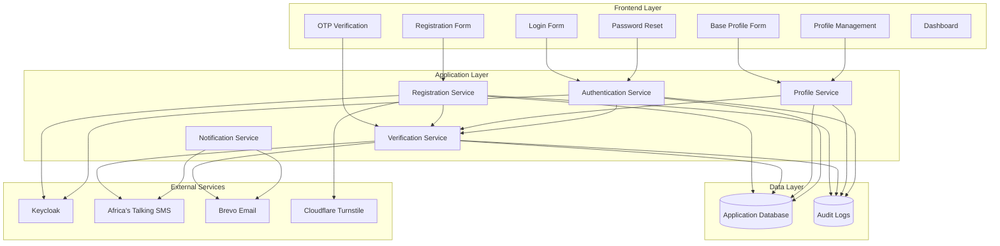
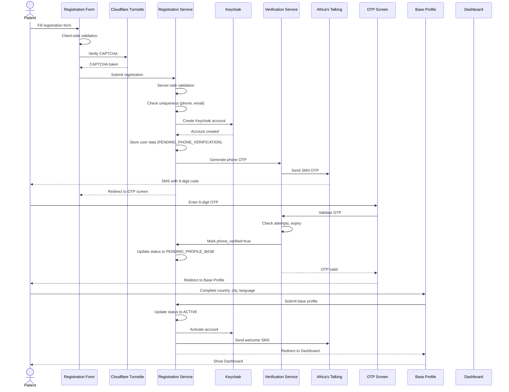

# Design Document: Patient Registration Lifecycle

## Overview

The Patient Registration Lifecycle feature provides a comprehensive self-service registration and account management system for the FUENI MVP healthcare platform. This feature enables adult patients (≥18 years) across 9 African countries to create accounts, verify their identity through dual-channel OTP verification (phone and email), manage their profiles, authenticate securely, and maintain their accounts throughout their lifecycle.

### Key Capabilities

1. **Self-Service Registration**: Age-validated registration with identity information, dual communication channels (phone + email), password creation, and legal consent collection
2. **Dual OTP Verification**: Immediate phone verification via SMS OTP and deferred email verification via email OTP with soft-gate prompts
3. **Base Profile Completion**: Mandatory collection of country, city, and language preferences post-phone verification
4. **Flexible Authentication**: Login using either email or phone number with password
5. **Profile Management**: Modification of profile fields with appropriate security measures (OTP re-verification for contact changes)
6. **Password Management**: Secure password reset via email OTP
7. **Account Lifecycle**: Automated cleanup of abandoned registrations (7 days) and inactive accounts (365 days with 30-day warning)
8. **Security & Compliance**: Anti-bot protection (Cloudflare Turnstile), rate limiting, encryption, RGPD compliance, and comprehensive audit logging

### Technology Stack

- **Frontend**: React 19, TypeScript, TanStack Router, TanStack Query, React Hook Form, Zod validation
- **UI Components**: Radix UI primitives, Tailwind CSS, shadcn/ui patterns
- **Authentication**: Keycloak (external identity provider)
- **SMS Gateway**: Africa's Talking (9 African countries)
- **Email Gateway**: Brevo (transactional emails)
- **Anti-Bot**: Cloudflare Turnstile (invisible CAPTCHA)
- **Internationalization**: i18next, react-i18next (French, English)
- **Phone Validation**: libphonenumber-js

### Design Principles

1. **Progressive Disclosure**: Collect information in stages (registration → phone OTP → base profile → optional profile)
2. **Dual Verification**: Phone verification is mandatory and immediate; email verification is deferred with soft-gate prompts
3. **Friction Minimization**: No government ID upload, no manual admin approval, no password confirmation field
4. **Security by Default**: Argon2id password hashing, rate limiting, anti-bot protection, session management
5. **Mobile-First**: Responsive design optimized for mobile devices (320px+)
6. **Accessibility**: WCAG compliance with keyboard navigation, screen reader support, and sufficient contrast
7. **Internationalization**: Full French and English support with locale-appropriate formatting
8. **Error Recovery**: Clear error messages, form data preservation, retry mechanisms

## Architecture

### System Components



### Registration Flow



## Components and Interfaces

### Frontend Components

This feature requires the following React components with TypeScript interfaces:

#### 1. Registration Form Component

**File**: `src/components/registration/RegistrationForm.tsx`

**Purpose**: Collect patient identity, contact information, password, and legal consent

**Key Features**:

- Real-time password strength indicator (Faible, Moyen, Fort, Très fort)
- Dynamic password rules checklist with checkmarks
- Auto-detect country code from IP geolocation (fallback: Senegal +221)
- Calendar selector with decade navigation for date of birth
- Cloudflare Turnstile invisible CAPTCHA integration
- Session storage for form data preservation
- Mobile-optimized input types (tel, email, numeric)

**TypeScript Interfaces**:

```typescript
interface RegistrationFormData {
  firstName: string;
  lastName: string;
  dateOfBirth: Date | null;
  gender: "F" | "M" | "O" | "N";
  phoneNumber: string;
  countryCode: string;
  email: string;
  password: string;
  acceptTerms: boolean;
  acceptPrivacy: boolean;
}

interface PasswordStrength {
  level: "weak" | "medium" | "strong" | "very-strong";
  label: string;
  checks: {
    minLength: boolean;
    hasUppercase: boolean;
    hasLowercase: boolean;
    hasDigit: boolean;
    hasSpecial: boolean;
    noSpaces: boolean;
  };
}
```

**Validation Schema** (Zod):

```typescript
const registrationSchema = z.object({
  firstName: z
    .string()
    .min(1)
    .max(80)
    .regex(/^[a-zA-ZÀ-ÿ\s'-]+$/),
  lastName: z
    .string()
    .min(1)
    .max(80)
    .regex(/^[a-zA-ZÀ-ÿ\s'-]+$/),
  dateOfBirth: z.date().refine((date) => {
    const age = differenceInYears(new Date(), date);
    return age >= 18 && age <= 120;
  }),
  gender: z.enum(["F", "M", "O", "N"]),
  phoneNumber: z.string().refine((phone) => isValidPhoneNumber(phone)),
  countryCode: z.string(),
  email: z.string().email().toLowerCase(),
  password: z
    .string()
    .min(8)
    .max(128)
    .regex(/[A-Z]/)
    .regex(/[a-z]/)
    .regex(/[0-9]/)
    .regex(/[^a-zA-Z0-9]/)
    .refine((pwd) => !pwd.includes(" ")),
  acceptTerms: z.literal(true),
  acceptPrivacy: z.literal(true),
});
```

#### 2. OTP Verification Component

**File**: `src/components/registration/OTPVerification.tsx`

**Purpose**: Verify phone number or email address via 6-digit OTP code

**Key Features**:

- 6 individual input boxes with auto-focus and auto-advance
- Masked display of phone/email (last 2 digits visible for phone, first char + domain for email)
- Countdown timer for resend cooldown (60s for phone, 120s for email)
- Attempt counter (max 3 attempts)
- "Modifier mes informations" link to return to registration form
- Mobile numeric keyboard (inputmode="numeric")

**TypeScript Interfaces**:

```typescript
interface OTPVerificationProps {
  verificationType: "phone" | "email";
  maskedIdentifier: string;
  onVerify: (code: string) => Promise<void>;
  onResend: () => Promise<void>;
  onModify?: () => void;
  maxAttempts: number;
  cooldownSeconds: number;
}

interface OTPState {
  code: string[];
  attempts: number;
  isExpired: boolean;
  canResend: boolean;
  remainingCooldown: number;
  error: string | null;
}
```

#### 3. Base Profile Form Component

**File**: `src/components/registration/BaseProfileForm.tsx`

**Purpose**: Collect mandatory profile information (country, city, language) after phone verification

**Key Features**:

- Country dropdown with 9 MVP countries at top
- City dropdown populated based on selected country
- Language selection (Français, English)
- Optional address field (2 lines)
- Pre-filled country based on phone country code
- Pre-selected language based on browser detection

**TypeScript Interfaces**:

```typescript
interface BaseProfileFormData {
  country: string;
  city: string;
  language: "fr" | "en";
  address?: string;
}

interface Country {
  code: string;
  name: string;
  isMVP: boolean;
}

interface City {
  id: string;
  name: string;
  countryCode: string;
}
```

#### 4. Login Form Component

**File**: `src/components/auth/LoginForm.tsx`

**Purpose**: Authenticate users with email/phone + password

**Key Features**:

- Single identifier field accepting email or phone number
- Auto-detection of identifier type (@ character presence)
- Phone number normalization to E.164 format
- "Mot de passe oublié" link to password reset
- Rate limiting feedback (5 attempts per minute)

**TypeScript Interfaces**:

```typescript
interface LoginFormData {
  identifier: string; // email or phone
  password: string;
}

interface LoginResponse {
  success: boolean;
  sessionToken?: string;
  requiresEmailVerification?: boolean;
  error?: string;
}
```

#### 5. Password Reset Component

**File**: `src/components/auth/PasswordReset.tsx`

**Purpose**: Reset password via email OTP verification

**Key Features**:

- Email input with validation
- OTP verification (6 digits, 10-minute validity)
- New password entry with strength indicator
- Password confirmation field
- Auto-login after successful reset

**TypeScript Interfaces**:

```typescript
interface PasswordResetFormData {
  email: string;
  otp?: string;
  newPassword?: string;
  confirmPassword?: string;
}

interface PasswordResetState {
  step: "email" | "otp" | "newPassword";
  email: string;
  otpAttempts: number;
}
```

#### 6. Profile Management Component

**File**: `src/components/profile/ProfileManagement.tsx`

**Purpose**: View and edit profile information with appropriate security measures

**Key Features**:

- Display all profile fields with edit buttons
- OTP re-verification for phone/email changes
- Current password requirement for password changes
- Support contact info for identity field changes
- Profile completion percentage indicator

**TypeScript Interfaces**:

```typescript
interface ProfileData {
  firstName: string;
  lastName: string;
  dateOfBirth: Date;
  gender: "F" | "M" | "O" | "N";
  phoneNumber: string;
  phoneVerified: boolean;
  email: string;
  emailVerified: boolean;
  country: string;
  city: string;
  language: "fr" | "en";
  address?: string;
  postalCode?: string;
  emergencyContact?: EmergencyContact;
  notificationPreferences: NotificationPreferences;
  profileCompletionPercentage: number;
}

interface EmergencyContact {
  name: string;
  relationship: "spouse" | "child" | "parent" | "friend" | "other";
  phoneNumber: string;
}

interface NotificationPreferences {
  smsEnabled: boolean;
  emailEnabled: boolean;
}
```

#### 7. Email Verification Banner Component

**File**: `src/components/dashboard/EmailVerificationBanner.tsx`

**Purpose**: Display persistent banner prompting email verification

**Key Features**:

- Non-dismissible banner while email_verified is false
- "Vérifier maintenant" button triggering email OTP flow
- Automatic removal after successful verification

**TypeScript Interfaces**:

```typescript
interface EmailVerificationBannerProps {
  email: string;
  onVerifyClick: () => void;
}
```

### Backend Services

#### 1. Registration Service

**Responsibilities**:

- Validate registration form data (server-side)
- Check uniqueness of phone number and email
- Create Keycloak account with PENDING_PHONE_VERIFICATION status
- Store user data in application database
- Trigger phone OTP generation
- Handle registration abandonment cleanup (7-day job)

**API Endpoints**:

```typescript
POST /api/v1/registration/register
Request: {
  firstName: string;
  lastName: string;
  dateOfBirth: string; // ISO 8601
  gender: "F" | "M" | "O" | "N";
  phoneNumber: string; // E.164 format
  email: string;
  password: string;
  acceptTerms: boolean;
  acceptPrivacy: boolean;
  captchaToken: string;
}
Response: {
  success: boolean;
  userId?: string;
  redirectTo?: string; // OTP verification URL
  error?: string;
}

POST /api/v1/registration/complete-base-profile
Request: {
  userId: string;
  country: string;
  city: string;
  language: "fr" | "en";
  address?: string;
}
Response: {
  success: boolean;
  redirectTo?: string; // Dashboard URL
  error?: string;
}
```

#### 2. Verification Service

**Responsibilities**:

- Generate 6-digit numeric OTP codes (cryptographically secure)
- Send OTP via SMS (Africa's Talking) or email (Brevo)
- Validate OTP codes with attempt tracking and expiry checking
- Handle resend requests with cooldown enforcement
- Track rate limits (5 per hour per identifier)

**API Endpoints**:

```typescript
POST /api/v1/verification/send-phone-otp
Request: {
  userId: string;
  phoneNumber: string; // E.164 format
}
Response: {
  success: boolean;
  expiresAt: string; // ISO 8601
  canResendAt: string; // ISO 8601
  error?: string;
}

POST /api/v1/verification/verify-phone-otp
Request: {
  userId: string;
  otp: string;
}
Response: {
  success: boolean;
  attemptsRemaining?: number;
  redirectTo?: string;
  error?: string;
}

POST /api/v1/verification/send-email-otp
Request: {
  userId: string;
  email: string;
}
Response: {
  success: boolean;
  expiresAt: string;
  canResendAt: string;
  error?: string;
}

POST /api/v1/verification/verify-email-otp
Request: {
  userId: string;
  otp: string;
}
Response: {
  success: boolean;
  attemptsRemaining?: number;
  error?: string;
}
```

#### 3. Authentication Service

**Responsibilities**:

- Authenticate users via Keycloak
- Normalize identifiers (email lowercase, phone E.164)
- Manage sessions with 30-day inactivity expiry
- Handle password reset flow
- Implement rate limiting (5 attempts per minute)
- Invalidate sessions on password change

**API Endpoints**:

```typescript
POST /api/v1/auth/login
Request: {
  identifier: string; // email or phone
  password: string;
}
Response: {
  success: boolean;
  sessionToken?: string;
  user?: UserProfile;
  requiresEmailVerification?: boolean;
  error?: string;
}

POST /api/v1/auth/logout
Request: {
  sessionToken: string;
}
Response: {
  success: boolean;
}

POST /api/v1/auth/reset-password-request
Request: {
  email: string;
}
Response: {
  success: boolean;
  message: string; // Always returns success to prevent email enumeration
}

POST /api/v1/auth/reset-password-complete
Request: {
  email: string;
  otp: string;
  newPassword: string;
}
Response: {
  success: boolean;
  sessionToken?: string;
  error?: string;
}
```

#### 4. Profile Service

**Responsibilities**:

- Retrieve user profile data
- Update profile fields with appropriate validation
- Trigger OTP verification for phone/email changes
- Calculate profile completion percentage
- Handle data export requests (RGPD)
- Log profile modifications for audit

**API Endpoints**:

```typescript
GET /api/v1/profile/:userId
Response: {
  profile: ProfileData;
}

PATCH /api/v1/profile/:userId
Request: {
  fields: Partial<ProfileData>;
  currentPassword?: string; // Required for password changes
}
Response: {
  success: boolean;
  requiresVerification?: {
    type: "phone" | "email";
    identifier: string;
  };
  error?: string;
}

POST /api/v1/profile/:userId/export-data
Response: {
  success: boolean;
  message: string; // "Export link sent to your email"
}
```

#### 5. Notification Service

**Responsibilities**:

- Send SMS via Africa's Talking
- Send emails via Brevo
- Handle notification templates (French/English)
- Track delivery status
- Respect notification preferences (except transactional)

**Message Templates**:

```typescript
// SMS Templates
const SMS_TEMPLATES = {
  PHONE_OTP_FR: "FUENI : votre code de vérification est {code}. Valide 5 minutes",
  PHONE_OTP_EN: "FUENI: your verification code is {code}. Valid 5 minutes",
  WELCOME_FR: "Bienvenue sur FUENI, {firstName} ! Votre compte est créé",
  WELCOME_EN: "Welcome to FUENI, {firstName}! Your account is created",
};

// Email Templates (Brevo template IDs)
const EMAIL_TEMPLATES = {
  EMAIL_OTP_FR: "OTP_PATIENT_EMAIL_VERIFICATION_FR",
  EMAIL_OTP_EN: "OTP_PATIENT_EMAIL_VERIFICATION_EN",
  PASSWORD_RESET_FR: "PASSWORD_RESET_FR",
  PASSWORD_RESET_EN: "PASSWORD_RESET_EN",
  WELCOME_FR: "WELCOME_PATIENT_FR",
  WELCOME_EN: "WELCOME_PATIENT_EN",
  INACTIVITY_WARNING_FR: "INACTIVITY_WARNING_FR",
  INACTIVITY_WARNING_EN: "INACTIVITY_WARNING_EN",
  ACCOUNT_DELETED_FR: "ACCOUNT_DELETED_FR",
  ACCOUNT_DELETED_EN: "ACCOUNT_DELETED_EN",
};
```

## Data Models

### Patient Account

**Table**: `patients`

```typescript
interface PatientAccount {
  id: string; // UUID
  keycloakId: string; // Keycloak user ID

  // Identity Information
  firstName: string; // 1-80 characters
  lastName: string; // 1-80 characters
  dateOfBirth: Date;
  gender: "F" | "M" | "O" | "N";

  // Contact Information
  phoneNumber: string; // E.164 format
  phoneVerified: boolean;
  phoneVerifiedAt: Date | null;
  email: string; // Lowercase
  emailVerified: boolean;
  emailVerifiedAt: Date | null;

  // Base Profile
  country: string; // ISO 3166-1 alpha-2
  city: string;
  language: "fr" | "en";
  address: string | null;
  postalCode: string | null;

  // Emergency Contact
  emergencyContactName: string | null;
  emergencyContactRelationship: "spouse" | "child" | "parent" | "friend" | "other" | null;
  emergencyContactPhone: string | null;

  // Notification Preferences
  smsNotificationsEnabled: boolean; // Default: true
  emailNotificationsEnabled: boolean; // Default: true

  // Account Status
  accountStatus:
    | "PENDING_PHONE_VERIFICATION"
    | "PENDING_PROFILE_BASE"
    | "ACTIVE"
    | "SUSPENDED"
    | "DELETED";

  // Consent
  termsAcceptedAt: Date;
  privacyAcceptedAt: Date;

  // Timestamps
  createdAt: Date;
  updatedAt: Date;
  lastLoginAt: Date | null;

  // Computed Fields
  profileCompletionPercentage: number; // 0-100
}
```

**Indexes**:

- `phoneNumber` (unique)
- `email` (unique)
- `keycloakId` (unique)
- `accountStatus`
- `lastLoginAt` (for inactivity cleanup)
- `createdAt` (for abandonment cleanup)

### OTP Verification

**Table**: `otp_verifications`

```typescript
interface OTPVerification {
  id: string; // UUID
  userId: string; // Foreign key to patients.id

  // OTP Details
  otpCode: string; // Hashed (Argon2id)
  otpType: "phone" | "email";
  identifier: string; // Phone (E.164) or email

  // Validity
  expiresAt: Date; // 5 minutes for phone, 10 minutes for email
  attempts: number; // Max 3
  verified: boolean;
  verifiedAt: Date | null;

  // Timestamps
  createdAt: Date;
}
```

**Indexes**:

- `userId`
- `identifier, otpType, verified` (composite for rate limiting)
- `expiresAt` (for cleanup)

### Audit Log

**Table**: `audit_logs`

```typescript
interface AuditLog {
  id: string; // UUID
  userId: string | null; // Foreign key to patients.id (null for failed login attempts)

  // Event Details
  eventType:
    | "REGISTRATION_ATTEMPT"
    | "REGISTRATION_SUCCESS"
    | "LOGIN_ATTEMPT"
    | "LOGIN_SUCCESS"
    | "LOGIN_FAILURE"
    | "OTP_GENERATED"
    | "OTP_VERIFIED"
    | "OTP_FAILED"
    | "PASSWORD_RESET_REQUEST"
    | "PASSWORD_RESET_SUCCESS"
    | "PROFILE_UPDATED"
    | "ACCOUNT_DELETED";
  eventData: Record<string, any>; // JSON field with event-specific data

  // Context
  ipAddress: string;
  userAgent: string;

  // Timestamp
  createdAt: Date;
}
```

**Indexes**:

- `userId, createdAt` (composite for user activity history)
- `eventType, createdAt` (composite for monitoring)
- `ipAddress, createdAt` (composite for abuse detection)

### Session

**Table**: `sessions` (managed by Keycloak, but tracked in application)

```typescript
interface Session {
  id: string; // UUID
  userId: string; // Foreign key to patients.id
  keycloakSessionId: string;

  // Session Details
  ipAddress: string;
  userAgent: string;

  // Validity
  expiresAt: Date; // 30 days from last activity
  lastActivityAt: Date;

  // Timestamps
  createdAt: Date;
}
```

**Indexes**:

- `userId`
- `keycloakSessionId` (unique)
- `expiresAt` (for cleanup)

### Rate Limit Tracker

**Table**: `rate_limits`

```typescript
interface RateLimit {
  id: string; // UUID

  // Identifier
  limitType: "REGISTRATION" | "OTP_PHONE" | "OTP_EMAIL" | "LOGIN" | "PASSWORD_RESET";
  identifier: string; // IP address, phone number, or email

  // Tracking
  attempts: number;
  windowStart: Date;
  windowEnd: Date;

  // Timestamps
  createdAt: Date;
  updatedAt: Date;
}
```

**Indexes**:

- `limitType, identifier, windowEnd` (composite for rate limit checks)

## Correctness Properties

_A property is a characteristic or behavior that should hold true across all valid executions of a system—essentially, a formal statement about what the system should do. Properties serve as the bridge between human-readable specifications and machine-verifiable correctness guarantees._

### Property Reflection

After analyzing all acceptance criteria, I identified the following redundancies:

1. **Password hashing properties (5.11 and 24.3)**: Both test Argon2id hashing - combine into single property
2. **Email validation properties (3.3 and 38.4)**: Both test RFC email validation - combine into single property
3. **Phone validation properties (3.2 and 38.5)**: Both test E.164 phone validation - combine into single property
4. **Name length validation (2.1 and 2.2)**: Both test 1-80 character length - combine into single property for name fields
5. **Phone normalization properties (3.9, 16.6, 16.8)**: Multiple properties test phone normalization - combine into comprehensive normalization property
6. **Login identifier acceptance (16.1 and 16.2)**: Both test identifier acceptance - combine into single property

After consolidation, the unique properties are:

1. Age validation (18-120 years)
2. Name field validation (length and character constraints)
3. Phone number validation and normalization (E.164 format)
4. Email validation and normalization (RFC format, lowercase)
5. Phone/email uniqueness constraints
6. Password complexity validation
7. Password hashing (Argon2id)
8. OTP generation (6 digits, numeric)
9. OTP verification and attempt tracking
10. Account status transitions
11. Login identifier acceptance and normalization
12. Session invalidation on password change
13. Input sanitization and trimming
14. Unicode normalization

### Correctness Properties

### Property 1: Age Validation Range

_For any_ date of birth, the registration system SHALL accept the registration if and only if the calculated age is between 18 and 120 years (inclusive) at the time of submission.

**Validates: Requirements 1.1, 1.4, 1.5, 1.6**

### Property 2: Name Field Validation

_For any_ string input for first name or last name fields, the registration system SHALL accept the input if and only if the length is between 1 and 80 characters AND the string contains only letters (including accented characters), hyphens, apostrophes, and spaces.

**Validates: Requirements 2.1, 2.2, 2.3**

### Property 3: Phone Number Validation and Normalization

_For any_ phone number input and selected country, the registration system SHALL validate the phone number against E.164 format rules for that country, AND if valid, SHALL normalize it to E.164 format (with country code prefix) before storage or comparison.

**Validates: Requirements 3.2, 3.9, 3.11, 16.6, 16.8, 38.5**

### Property 4: Email Validation and Normalization

_For any_ email address input, the registration system SHALL validate it against RFC email format standards, AND if valid, SHALL normalize it to lowercase before storage or comparison.

**Validates: Requirements 3.3, 3.4, 3.10, 16.9, 38.4**

### Property 5: Communication Channel Uniqueness

_For any_ phone number or email address, attempting to register a second account with the same phone number or email address SHALL fail with an appropriate error message, regardless of the casing or formatting of the input.

**Validates: Requirements 4.1, 4.2, 4.6, 4.7**

### Property 6: Password Complexity Validation

_For any_ password string, the registration system SHALL accept the password if and only if it meets ALL of the following criteria: length between 8 and 128 characters, contains at least one uppercase letter, contains at least one lowercase letter, contains at least one digit, contains at least one special character (non-alphanumeric printable character), and contains no space characters.

**Validates: Requirements 5.1, 5.2, 5.3, 5.4, 5.5, 5.6, 5.7**

### Property 7: Password Hashing Security

_For any_ password string, the authentication system SHALL hash the password using the Argon2id algorithm before storage, AND the resulting hash SHALL successfully verify against the original password, AND the original password SHALL never be stored in plain text or logged.

**Validates: Requirements 5.11, 5.12, 24.3, 24.4, 24.5**

### Property 8: OTP Generation Format

_For any_ OTP generation request (phone or email verification), the verification system SHALL generate a code that is exactly 6 digits long and contains only numeric characters (0-9).

**Validates: Requirements 9.1, 10.3, 21.3, 22.3**

### Property 9: OTP Verification and Attempt Tracking

_For any_ OTP verification attempt, the verification system SHALL correctly identify whether the provided code matches the generated code, SHALL decrement the remaining attempts counter on incorrect attempts, SHALL mark the verification as successful on correct attempt, and SHALL block further attempts after 3 incorrect attempts.

**Validates: Requirements 9.4, 9.14, 9.16, 9.17, 10.6, 10.17, 10.18**

### Property 10: Account Status Transitions

_For any_ patient account, the account status SHALL transition through the valid state machine: PENDING_PHONE_VERIFICATION → PENDING_PROFILE_BASE → ACTIVE, and SHALL only transition to ACTIVE when all required profile fields (country, city, language) are completed.

**Validates: Requirements 11.14, 11.15, 12.1**

### Property 11: Login Identifier Acceptance and Normalization

_For any_ login identifier input, the authentication system SHALL accept it as either an email address (if it contains '@') or a phone number (if it does not contain '@'), SHALL normalize phone numbers by removing decorative characters and converting to E.164 format, SHALL normalize email addresses to lowercase, and SHALL perform case-insensitive matching for email addresses.

**Validates: Requirements 16.1, 16.2, 16.3, 16.4, 16.5, 16.6, 16.7, 16.8, 16.9**

### Property 12: Session Invalidation on Password Change

_For any_ password change operation, the authentication system SHALL invalidate all active sessions for that user across all devices, requiring re-authentication with the new password.

**Validates: Requirements 18.1, 18.2, 17.14**

### Property 13: Input Sanitization and Trimming

_For any_ text input field, the registration system SHALL trim leading and trailing whitespace before validation and storage, AND SHALL sanitize the input to remove or escape potentially harmful characters (SQL injection patterns, XSS attack patterns, HTML special characters).

**Validates: Requirements 38.2, 38.3, 38.9, 38.11, 38.12**

### Property 14: Unicode Normalization for Names

_For any_ name input containing Unicode characters, the registration system SHALL normalize the Unicode characters to a consistent form (NFC normalization) to ensure consistent storage and comparison.

**Validates: Requirements 38.10, 38.11**

## Error Handling

### Error Categories

The system handles errors across multiple categories with appropriate user feedback and recovery mechanisms:

#### 1. Validation Errors

**Client-Side Validation**:

- Triggered on field blur and form submission
- Inline error messages displayed below each field
- Global error banner for multiple validation failures
- Form remains editable with all data preserved

**Server-Side Validation**:

- Validates all inputs even if client-side validation passes
- Returns structured error responses with field-specific messages
- Prevents double submission during validation

**Common Validation Errors**:

- Age < 18: "Vous devez avoir 18 ans ou plus pour vous inscrire"
- Invalid phone: "Numéro invalide pour le pays sélectionné"
- Invalid email: "Adresse e-mail invalide"
- Weak password: Dynamic checklist shows unmet requirements
- Missing required fields: "Veuillez compléter tous les champs obligatoires marqués d'un astérisque (\*)"

#### 2. Uniqueness Constraint Errors

**Phone Number Already Registered**:

- Error: "Un compte existe déjà avec ce numéro. Connectez-vous"
- Provides direct link to login page
- Does not reveal whether email is also registered (security)

**Email Address Already Registered**:

- Error: "Un compte existe déjà avec cet e-mail. Connectez-vous"
- Provides direct link to login page
- Does not reveal whether phone is also registered (security)

**Recovery**: User can login with existing credentials or use different phone/email

#### 3. OTP Verification Errors

**Incorrect OTP Code**:

- Error: "Code incorrect. Il vous reste {n} tentatives"
- Shows remaining attempts (3 max)
- Allows retry without regenerating code

**OTP Expired**:

- Error: "Votre code a expiré"
- Enables immediate resend button
- Generates new code with fresh expiry

**Too Many Incorrect Attempts**:

- Error: "Trop d'essais incorrects. Veuillez recommencer l'inscription"
- Redirects to registration form
- Discards entered data for security
- User must restart registration process

**Resend Limit Exceeded**:

- Error: "Vous avez demandé trop de renvois. Réessayez dans une heure"
- Displays countdown timer
- Prevents abuse of SMS/email services

**Recovery**: User can modify information, wait for cooldown, or restart registration

#### 4. Authentication Errors

**Invalid Credentials**:

- Error: "E-mail / téléphone ou mot de passe incorrect"
- Generic message prevents user enumeration
- Does not reveal which part is incorrect

**Rate Limit Exceeded**:

- Error: "Trop de tentatives. Veuillez réessayer plus tard"
- Blocks IP address for 15 minutes after 5 failed attempts per minute
- Displays countdown timer

**Account Not Found**:

- Same error as invalid credentials (security)
- Prevents user enumeration attacks

**Recovery**: User can reset password, wait for rate limit cooldown, or contact support

#### 5. Network and Service Errors

**Server Unavailable**:

- Error: "Service temporairement indisponible. Veuillez réessayer dans quelques minutes"
- Preserves all form data in session storage
- Provides retry button
- Implements exponential backoff for retries

**Network Connection Lost**:

- Error: "Connexion internet perdue. Vérifiez votre connexion"
- Monitors online/offline status
- Auto-retries when connection restored
- Preserves form data

**SMS Delivery Failure**:

- Logged on server for monitoring
- User sees generic "OTP sent" message (prevents revealing delivery status)
- Provides immediate resend option
- Fallback: User can contact support

**Email Delivery Failure**:

- Logged on server for monitoring
- User sees generic "OTP sent" message
- Provides resend option after cooldown
- Includes reminder to check spam folder

**Recovery**: Automatic retry with exponential backoff, manual retry button, form data preservation

#### 6. Anti-Bot and Security Errors

**CAPTCHA Verification Failed**:

- Error: "Vérification de sécurité échouée. Veuillez réessayer plus tard"
- Blocks IP address for 15 minutes after 3 consecutive failures
- Logs suspicious activity for monitoring

**Rate Limit Exceeded (Various Operations)**:

- Registration: 5 attempts per hour per IP
- OTP requests: 5 per hour per phone/email
- Login: 5 attempts per minute per identifier
- Password reset: 3 per hour per email
- Error: "Trop de tentatives. Veuillez réessayer plus tard"
- Displays countdown timer

**Recovery**: Wait for rate limit window to expire, contact support if legitimate user

#### 7. Session and State Errors

**Session Expired**:

- Redirects to login page with message
- Preserves intended destination for post-login redirect
- Clears stale session data

**Invalid Session Token**:

- Treats as expired session
- Requires re-authentication
- Logs potential security incident

**State Mismatch** (e.g., accessing base profile when already active):

- Redirects to appropriate page based on account status
- Prevents invalid state transitions

**Recovery**: Re-authenticate, system automatically redirects to correct page

#### 8. Data Integrity Errors

**Concurrent Modification**:

- Uses optimistic locking with version numbers
- Error: "Ces informations ont été modifiées. Veuillez actualiser et réessayer"
- Provides refresh button

**Database Constraint Violation**:

- Logged on server with full context
- User sees generic error: "Une erreur est survenue. Veuillez réessayer"
- Provides retry button
- Alerts administrators for investigation

**Recovery**: Refresh data, retry operation, contact support if persists

### Error Response Format

All API errors follow a consistent JSON structure:

```typescript
interface ErrorResponse {
  success: false;
  error: {
    code: string; // Machine-readable error code
    message: string; // User-friendly localized message
    field?: string; // Specific field for validation errors
    details?: Record<string, any>; // Additional context
  };
  timestamp: string; // ISO 8601
  requestId: string; // For support and debugging
}
```

### Error Logging and Monitoring

**Client-Side Error Tracking**:

- All errors logged to browser console (development)
- Critical errors sent to error tracking service (production)
- Includes user context (anonymized), browser info, stack trace

**Server-Side Error Tracking**:

- All errors logged with severity levels (ERROR, WARN, INFO)
- Includes request ID, user ID (if authenticated), IP address, user agent
- Sensitive data (passwords, OTP codes) never logged
- Audit trail for security events

**Monitoring Alerts**:

- High error rates trigger alerts to operations team
- Failed OTP deliveries monitored for service health
- Rate limit violations monitored for abuse patterns
- Database errors trigger immediate investigation

### User Support and Recovery

**Support Contact Information**:

- Displayed in error messages for unrecoverable errors
- Email: support@fueni.com
- Phone: Available in each MVP country
- In-app chat (post-MVP)

**Self-Service Recovery Options**:

- Password reset via email OTP
- Phone number change via support (with identity verification)
- Email address change via support (with identity verification)
- Account recovery via support (with identity verification)

**Escalation Path**:

1. User attempts self-service recovery
2. If unsuccessful, contacts support via email/phone
3. Support verifies identity and assists with recovery
4. Complex cases escalated to technical team

## Testing Strategy

### Overview

The patient registration lifecycle feature requires comprehensive testing across multiple dimensions: functional correctness, security, performance, accessibility, and internationalization. The testing strategy combines property-based testing for universal properties, example-based unit tests for specific scenarios, integration tests for service interactions, and end-to-end tests for complete user flows.

### Property-Based Testing

**Applicability Assessment**: This feature IS appropriate for property-based testing because it involves:

- Pure validation functions with clear input/output behavior (age validation, name validation, phone/email validation)
- Universal properties that should hold across wide input ranges (normalization, uniqueness, password hashing)
- Data transformations (phone E.164 normalization, email lowercase, Unicode normalization)
- Business logic with well-defined rules (OTP generation, account status transitions)

**Property Testing Library**: **fast-check** (JavaScript/TypeScript property-based testing library)

**Configuration**:

- Minimum 100 iterations per property test
- Each property test tagged with reference to design document property
- Tag format: `Feature: patient-registration-lifecycle, Property {number}: {property_text}`

**Property Test Implementation**:

#### Property 1: Age Validation Range

```typescript
// Feature: patient-registration-lifecycle, Property 1: Age Validation Range
test("age validation accepts 18-120 years", () => {
  fc.assert(
    fc.property(
      fc.date({ min: new Date("1900-01-01"), max: new Date() }),
      fc.date({ min: new Date(), max: new Date("2100-12-31") }),
      (dateOfBirth, currentDate) => {
        const age = differenceInYears(currentDate, dateOfBirth);
        const isValid = age >= 18 && age <= 120;
        const result = validateAge(dateOfBirth, currentDate);
        return result.valid === isValid;
      },
    ),
    { numRuns: 100 },
  );
});
```

#### Property 2: Name Field Validation

```typescript
// Feature: patient-registration-lifecycle, Property 2: Name Field Validation
test("name validation accepts 1-80 chars with allowed characters", () => {
  fc.assert(
    fc.property(fc.string({ minLength: 0, maxLength: 100 }), (name) => {
      const isValidLength = name.length >= 1 && name.length <= 80;
      const hasOnlyAllowedChars = /^[a-zA-ZÀ-ÿ\s'-]+$/.test(name);
      const shouldAccept = isValidLength && hasOnlyAllowedChars;
      const result = validateName(name);
      return result.valid === shouldAccept;
    }),
    { numRuns: 100 },
  );
});
```

#### Property 3: Phone Number Validation and Normalization

```typescript
// Feature: patient-registration-lifecycle, Property 3: Phone Number Validation and Normalization
test("phone validation and normalization to E.164", () => {
  fc.assert(
    fc.property(
      fc.constantFrom("SN", "CI", "ML", "BJ", "TG", "BF", "NE", "CM", "CD"),
      fc.string({ minLength: 8, maxLength: 15 }),
      (countryCode, phoneDigits) => {
        const phone = phoneDigits.replace(/\D/g, ""); // Remove non-digits
        const result = validateAndNormalizePhone(phone, countryCode);

        if (result.valid) {
          // If valid, normalized form should be E.164
          expect(result.normalized).toMatch(/^\+\d{10,15}$/);
          // Should be idempotent
          const secondNormalization = validateAndNormalizePhone(result.normalized, countryCode);
          expect(secondNormalization.normalized).toBe(result.normalized);
        }
        return true;
      },
    ),
    { numRuns: 100 },
  );
});
```

#### Property 4: Email Validation and Normalization

```typescript
// Feature: patient-registration-lifecycle, Property 4: Email Validation and Normalization
test("email validation and lowercase normalization", () => {
  fc.assert(
    fc.property(fc.emailAddress(), fc.constantFrom("lower", "upper", "mixed"), (email, casing) => {
      const casedEmail =
        casing === "upper" ? email.toUpperCase() : casing === "mixed" ? mixCase(email) : email;

      const result = validateAndNormalizeEmail(casedEmail);

      if (result.valid) {
        // Normalized should be lowercase
        expect(result.normalized).toBe(result.normalized.toLowerCase());
        // Should match original email (case-insensitive)
        expect(result.normalized.toLowerCase()).toBe(email.toLowerCase());
      }
      return true;
    }),
    { numRuns: 100 },
  );
});
```

#### Property 5: Communication Channel Uniqueness

```typescript
// Feature: patient-registration-lifecycle, Property 5: Communication Channel Uniqueness
test("phone and email uniqueness enforced", async () => {
  fc.assert(
    await fc.asyncProperty(
      fc.record({
        phone: fc.string({ minLength: 10, maxLength: 15 }),
        email: fc.emailAddress(),
      }),
      async (userData) => {
        // First registration should succeed
        const firstResult = await registerUser(userData);
        expect(firstResult.success).toBe(true);

        // Second registration with same phone should fail
        const secondResult = await registerUser({
          ...userData,
          email: generateRandomEmail(),
        });
        expect(secondResult.success).toBe(false);
        expect(secondResult.error).toContain("compte existe déjà");

        // Second registration with same email should fail
        const thirdResult = await registerUser({
          ...userData,
          phone: generateRandomPhone(),
        });
        expect(thirdResult.success).toBe(false);
        expect(thirdResult.error).toContain("compte existe déjà");

        return true;
      },
    ),
    { numRuns: 100 },
  );
});
```

#### Property 6: Password Complexity Validation

```typescript
// Feature: patient-registration-lifecycle, Property 6: Password Complexity Validation
test("password complexity validation", () => {
  fc.assert(
    fc.property(fc.string({ minLength: 0, maxLength: 150 }), (password) => {
      const hasMinLength = password.length >= 8;
      const hasMaxLength = password.length <= 128;
      const hasUppercase = /[A-Z]/.test(password);
      const hasLowercase = /[a-z]/.test(password);
      const hasDigit = /[0-9]/.test(password);
      const hasSpecial = /[^a-zA-Z0-9]/.test(password);
      const noSpaces = !password.includes(" ");

      const shouldAccept =
        hasMinLength &&
        hasMaxLength &&
        hasUppercase &&
        hasLowercase &&
        hasDigit &&
        hasSpecial &&
        noSpaces;

      const result = validatePassword(password);
      return result.valid === shouldAccept;
    }),
    { numRuns: 100 },
  );
});
```

#### Property 7: Password Hashing Security

```typescript
// Feature: patient-registration-lifecycle, Property 7: Password Hashing Security
test("password hashing with Argon2id", async () => {
  fc.assert(
    await fc.asyncProperty(fc.string({ minLength: 8, maxLength: 128 }), async (password) => {
      const hash = await hashPassword(password);

      // Hash should not contain original password
      expect(hash).not.toContain(password);

      // Hash should verify against original password
      const isValid = await verifyPassword(password, hash);
      expect(isValid).toBe(true);

      // Hash should not verify against different password
      const wrongPassword = password + "X";
      const isInvalid = await verifyPassword(wrongPassword, hash);
      expect(isInvalid).toBe(false);

      // Hash should be Argon2id format
      expect(hash).toMatch(/^\$argon2id\$/);

      return true;
    }),
    { numRuns: 100 },
  );
});
```

#### Property 8: OTP Generation Format

```typescript
// Feature: patient-registration-lifecycle, Property 8: OTP Generation Format
test("OTP generation produces 6-digit numeric codes", () => {
  fc.assert(
    fc.property(fc.nat(), (_seed) => {
      const otp = generateOTP();

      // Should be exactly 6 characters
      expect(otp).toHaveLength(6);

      // Should be all numeric
      expect(otp).toMatch(/^\d{6}$/);

      // Should be within valid range
      const numericValue = parseInt(otp, 10);
      expect(numericValue).toBeGreaterThanOrEqual(0);
      expect(numericValue).toBeLessThanOrEqual(999999);

      return true;
    }),
    { numRuns: 100 },
  );
});
```

#### Property 9: OTP Verification and Attempt Tracking

```typescript
// Feature: patient-registration-lifecycle, Property 9: OTP Verification and Attempt Tracking
test("OTP verification tracks attempts correctly", async () => {
  fc.assert(
    await fc.asyncProperty(fc.string({ minLength: 6, maxLength: 6 }), async (incorrectOTP) => {
      const { userId, correctOTP } = await createTestUser();

      // Incorrect OTP should fail and decrement attempts
      for (let i = 0; i < 3; i++) {
        const result = await verifyOTP(userId, incorrectOTP);
        expect(result.success).toBe(false);
        expect(result.attemptsRemaining).toBe(2 - i);
      }

      // Fourth attempt should be blocked
      const blockedResult = await verifyOTP(userId, incorrectOTP);
      expect(blockedResult.success).toBe(false);
      expect(blockedResult.error).toContain("Trop d'essais");

      return true;
    }),
    { numRuns: 100 },
  );
});
```

#### Property 10: Account Status Transitions

```typescript
// Feature: patient-registration-lifecycle, Property 10: Account Status Transitions
test("account status transitions follow state machine", async () => {
  fc.assert(
    await fc.asyncProperty(
      fc.record({
        firstName: fc.string({ minLength: 1, maxLength: 80 }),
        lastName: fc.string({ minLength: 1, maxLength: 80 }),
        country: fc.constantFrom("SN", "CI", "ML", "BJ", "TG", "BF", "NE", "CM", "CD"),
        city: fc.string({ minLength: 1, maxLength: 100 }),
        language: fc.constantFrom("fr", "en"),
      }),
      async (userData) => {
        // After registration, status should be PENDING_PHONE_VERIFICATION
        const user = await registerUser(userData);
        expect(user.accountStatus).toBe("PENDING_PHONE_VERIFICATION");

        // After phone verification, status should be PENDING_PROFILE_BASE
        await verifyPhone(user.id);
        const afterPhoneVerification = await getUser(user.id);
        expect(afterPhoneVerification.accountStatus).toBe("PENDING_PROFILE_BASE");

        // After base profile completion, status should be ACTIVE
        await completeBaseProfile(user.id, {
          country: userData.country,
          city: userData.city,
          language: userData.language,
        });
        const afterProfileCompletion = await getUser(user.id);
        expect(afterProfileCompletion.accountStatus).toBe("ACTIVE");

        return true;
      },
    ),
    { numRuns: 100 },
  );
});
```

#### Property 11: Login Identifier Acceptance and Normalization

```typescript
// Feature: patient-registration-lifecycle, Property 11: Login Identifier Acceptance and Normalization
test("login identifier normalization", () => {
  fc.assert(
    fc.property(
      fc.oneof(fc.emailAddress(), fc.string({ minLength: 10, maxLength: 15 })),
      (identifier) => {
        const result = normalizeLoginIdentifier(identifier);

        if (identifier.includes("@")) {
          // Email: should be lowercase
          expect(result.type).toBe("email");
          expect(result.normalized).toBe(identifier.toLowerCase());
        } else {
          // Phone: should be E.164 format
          expect(result.type).toBe("phone");
          expect(result.normalized).toMatch(/^\+\d{10,15}$/);
        }

        return true;
      },
    ),
    { numRuns: 100 },
  );
});
```

#### Property 12: Session Invalidation on Password Change

```typescript
// Feature: patient-registration-lifecycle, Property 12: Session Invalidation on Password Change
test("password change invalidates all sessions", async () => {
  fc.assert(
    await fc.asyncProperty(fc.nat({ max: 5 }), async (numSessions) => {
      const user = await createTestUser();

      // Create multiple sessions
      const sessions = [];
      for (let i = 0; i < numSessions; i++) {
        const session = await createSession(user.id);
        sessions.push(session);
      }

      // All sessions should be valid
      for (const session of sessions) {
        const isValid = await validateSession(session.token);
        expect(isValid).toBe(true);
      }

      // Change password
      await changePassword(user.id, "NewPassword123!");

      // All sessions should be invalid
      for (const session of sessions) {
        const isValid = await validateSession(session.token);
        expect(isValid).toBe(false);
      }

      return true;
    }),
    { numRuns: 100 },
  );
});
```

#### Property 13: Input Sanitization and Trimming

```typescript
// Feature: patient-registration-lifecycle, Property 13: Input Sanitization and Trimming
test("input sanitization removes harmful characters", () => {
  fc.assert(
    fc.property(fc.string(), (input) => {
      const sanitized = sanitizeInput(input);

      // Should not contain SQL injection patterns
      expect(sanitized).not.toMatch(/(\bSELECT\b|\bDROP\b|\bINSERT\b|\bUPDATE\b|\bDELETE\b)/i);

      // Should not contain XSS patterns
      expect(sanitized).not.toMatch(/<script|javascript:|onerror=/i);

      // Should have trimmed whitespace
      expect(sanitized).toBe(sanitized.trim());

      // HTML special characters should be escaped
      if (input.includes("<") || input.includes(">") || input.includes("&")) {
        expect(sanitized).not.toContain("<");
        expect(sanitized).not.toContain(">");
      }

      return true;
    }),
    { numRuns: 100 },
  );
});
```

#### Property 14: Unicode Normalization for Names

```typescript
// Feature: patient-registration-lifecycle, Property 14: Unicode Normalization for Names
test("Unicode normalization for names", () => {
  fc.assert(
    fc.property(fc.unicodeString({ minLength: 1, maxLength: 80 }), (name) => {
      const normalized = normalizeUnicode(name);

      // Should be in NFC form
      expect(normalized).toBe(normalized.normalize("NFC"));

      // Should be idempotent
      const doubleNormalized = normalizeUnicode(normalized);
      expect(doubleNormalized).toBe(normalized);

      return true;
    }),
    { numRuns: 100 },
  );
});
```

### Unit Testing

Unit tests complement property-based tests by covering specific scenarios, edge cases, and integration points.

**Testing Framework**: **Vitest** (fast, Vite-native test runner)

**Coverage Target**: Minimum 80% code coverage for business logic

**Key Unit Test Areas**:

#### 1. Validation Functions

```typescript
describe("Age Validation", () => {
  it("should accept exactly 18 years old", () => {
    const dateOfBirth = subYears(new Date(), 18);
    expect(validateAge(dateOfBirth).valid).toBe(true);
  });

  it("should reject 17 years 364 days old", () => {
    const dateOfBirth = subYears(addDays(new Date(), 1), 18);
    expect(validateAge(dateOfBirth).valid).toBe(false);
  });

  it("should accept exactly 120 years old", () => {
    const dateOfBirth = subYears(new Date(), 120);
    expect(validateAge(dateOfBirth).valid).toBe(true);
  });

  it("should reject 120 years 1 day old", () => {
    const dateOfBirth = subDays(subYears(new Date(), 120), 1);
    expect(validateAge(dateOfBirth).valid).toBe(false);
  });

  it("should reject future dates", () => {
    const dateOfBirth = addDays(new Date(), 1);
    expect(validateAge(dateOfBirth).valid).toBe(false);
  });
});

describe("Password Validation", () => {
  it("should accept valid password", () => {
    expect(validatePassword("Password123!").valid).toBe(true);
  });

  it("should reject password with spaces", () => {
    expect(validatePassword("Pass word123!").valid).toBe(false);
  });

  it("should reject password without uppercase", () => {
    expect(validatePassword("password123!").valid).toBe(false);
  });

  it("should reject password without lowercase", () => {
    expect(validatePassword("PASSWORD123!").valid).toBe(false);
  });

  it("should reject password without digit", () => {
    expect(validatePassword("Password!").valid).toBe(false);
  });

  it("should reject password without special character", () => {
    expect(validatePassword("Password123").valid).toBe(false);
  });

  it("should reject password too short", () => {
    expect(validatePassword("Pass1!").valid).toBe(false);
  });

  it("should reject password too long", () => {
    const longPassword = "A".repeat(129) + "1!";
    expect(validatePassword(longPassword).valid).toBe(false);
  });
});
```

#### 2. Phone Number Validation (Country-Specific)

```typescript
describe("Phone Number Validation", () => {
  it("should validate Senegal phone number", () => {
    expect(validatePhone("771234567", "SN").valid).toBe(true);
    expect(validatePhone("771234567", "SN").normalized).toBe("+221771234567");
  });

  it("should validate Cameroon phone number (9 digits)", () => {
    expect(validatePhone("671234567", "CM").valid).toBe(true);
    expect(validatePhone("671234567", "CM").normalized).toBe("+237671234567");
  });

  it("should reject invalid length for country", () => {
    expect(validatePhone("12345", "SN").valid).toBe(false);
  });

  it("should normalize phone with spaces and hyphens", () => {
    expect(validatePhone("77 123 45 67", "SN").normalized).toBe("+221771234567");
    expect(validatePhone("77-123-45-67", "SN").normalized).toBe("+221771234567");
  });
});
```

#### 3. OTP Expiry and Cooldown

```typescript
describe("OTP Expiry", () => {
  it("should mark phone OTP as expired after 5 minutes", async () => {
    const { userId, otp } = await generatePhoneOTP();

    // Advance time by 5 minutes + 1 second
    jest.advanceTimersByTime(5 * 60 * 1000 + 1000);

    const result = await verifyOTP(userId, otp);
    expect(result.success).toBe(false);
    expect(result.error).toContain("expiré");
  });

  it("should mark email OTP as expired after 10 minutes", async () => {
    const { userId, otp } = await generateEmailOTP();

    // Advance time by 10 minutes + 1 second
    jest.advanceTimersByTime(10 * 60 * 1000 + 1000);

    const result = await verifyOTP(userId, otp);
    expect(result.success).toBe(false);
    expect(result.error).toContain("expiré");
  });
});

describe("OTP Resend Cooldown", () => {
  it("should enforce 60-second cooldown for phone OTP", async () => {
    const { userId } = await generatePhoneOTP();

    // Immediate resend should fail
    const result = await resendPhoneOTP(userId);
    expect(result.success).toBe(false);

    // After 60 seconds, resend should succeed
    jest.advanceTimersByTime(60 * 1000);
    const result2 = await resendPhoneOTP(userId);
    expect(result2.success).toBe(true);
  });

  it("should enforce 120-second cooldown for email OTP", async () => {
    const { userId } = await generateEmailOTP();

    // Immediate resend should fail
    const result = await resendEmailOTP(userId);
    expect(result.success).toBe(false);

    // After 120 seconds, resend should succeed
    jest.advanceTimersByTime(120 * 1000);
    const result2 = await resendEmailOTP(userId);
    expect(result2.success).toBe(true);
  });
});
```

#### 4. Rate Limiting

```typescript
describe("Rate Limiting", () => {
  it("should block after 5 registration attempts per hour per IP", async () => {
    const ipAddress = "192.168.1.1";

    for (let i = 0; i < 5; i++) {
      const result = await registerUser({ ...validUserData }, ipAddress);
      expect(result.success).toBe(true);
    }

    // 6th attempt should be blocked
    const result = await registerUser({ ...validUserData }, ipAddress);
    expect(result.success).toBe(false);
    expect(result.error).toContain("Trop de tentatives");
  });

  it("should block after 5 login attempts per minute", async () => {
    const identifier = "test@example.com";

    for (let i = 0; i < 5; i++) {
      await login(identifier, "wrongpassword");
    }

    // 6th attempt should be blocked
    const result = await login(identifier, "wrongpassword");
    expect(result.success).toBe(false);
    expect(result.error).toContain("Trop de tentatives");
  });
});
```

#### 5. Session Management

```typescript
describe("Session Management", () => {
  it("should expire session after 30 days of inactivity", async () => {
    const { userId, sessionToken } = await createSession();

    // Advance time by 30 days + 1 second
    jest.advanceTimersByTime(30 * 24 * 60 * 60 * 1000 + 1000);

    const isValid = await validateSession(sessionToken);
    expect(isValid).toBe(false);
  });

  it("should extend session on activity", async () => {
    const { userId, sessionToken } = await createSession();

    // Advance time by 29 days
    jest.advanceTimersByTime(29 * 24 * 60 * 60 * 1000);

    // Activity should extend session
    await recordActivity(sessionToken);

    // Advance time by another 29 days (58 days total, but only 29 since last activity)
    jest.advanceTimersByTime(29 * 24 * 60 * 60 * 1000);

    const isValid = await validateSession(sessionToken);
    expect(isValid).toBe(true);
  });
});
```

### Integration Testing

Integration tests verify interactions between services and external dependencies.

**Testing Approach**: Use mocks for external services (Keycloak, Africa's Talking, Brevo, Cloudflare Turnstile) in most tests, with occasional real integration tests in staging environment.

**Key Integration Test Areas**:

#### 1. Registration Flow Integration

```typescript
describe("Registration Flow", () => {
  it("should complete full registration flow", async () => {
    // Step 1: Submit registration form
    const registrationResult = await registerUser({
      firstName: "Jean",
      lastName: "Dupont",
      dateOfBirth: new Date("1990-01-01"),
      gender: "M",
      phoneNumber: "+221771234567",
      email: "jean.dupont@example.com",
      password: "Password123!",
      acceptTerms: true,
      acceptPrivacy: true,
      captchaToken: "mock-token",
    });

    expect(registrationResult.success).toBe(true);
    expect(registrationResult.userId).toBeDefined();

    // Verify Keycloak account created
    const keycloakUser = await keycloakClient.getUser(registrationResult.userId);
    expect(keycloakUser).toBeDefined();

    // Verify SMS OTP sent
    expect(smsGateway.sendSMS).toHaveBeenCalledWith(
      "+221771234567",
      expect.stringContaining("code de vérification"),
    );

    // Step 2: Verify phone OTP
    const otp = extractOTPFromSMS(smsGateway.sendSMS.mock.calls[0][1]);
    const verifyResult = await verifyPhoneOTP(registrationResult.userId, otp);

    expect(verifyResult.success).toBe(true);

    // Verify account status updated
    const user = await getUser(registrationResult.userId);
    expect(user.accountStatus).toBe("PENDING_PROFILE_BASE");
    expect(user.phoneVerified).toBe(true);

    // Step 3: Complete base profile
    const profileResult = await completeBaseProfile(registrationResult.userId, {
      country: "SN",
      city: "Dakar",
      language: "fr",
    });

    expect(profileResult.success).toBe(true);

    // Verify account activated
    const activeUser = await getUser(registrationResult.userId);
    expect(activeUser.accountStatus).toBe("ACTIVE");

    // Verify welcome SMS sent
    expect(smsGateway.sendSMS).toHaveBeenCalledWith(
      "+221771234567",
      expect.stringContaining("Bienvenue"),
    );
  });
});
```

#### 2. Email Verification Flow Integration

```typescript
describe("Email Verification Flow", () => {
  it("should verify email via OTP", async () => {
    const user = await createActiveUser();

    // Trigger email verification
    const result = await sendEmailOTP(user.id);
    expect(result.success).toBe(true);

    // Verify email sent
    expect(emailGateway.sendEmail).toHaveBeenCalledWith({
      to: user.email,
      template: "OTP_PATIENT_EMAIL_VERIFICATION_FR",
      variables: expect.objectContaining({
        firstName: user.firstName,
        code: expect.stringMatching(/^\d{6}$/),
      }),
    });

    // Extract OTP from email
    const otp = extractOTPFromEmail(emailGateway.sendEmail.mock.calls[0][0]);

    // Verify OTP
    const verifyResult = await verifyEmailOTP(user.id, otp);
    expect(verifyResult.success).toBe(true);

    // Verify email marked as verified
    const updatedUser = await getUser(user.id);
    expect(updatedUser.emailVerified).toBe(true);
  });
});
```

#### 3. Password Reset Flow Integration

```typescript
describe("Password Reset Flow", () => {
  it("should reset password via email OTP", async () => {
    const user = await createActiveUser();
    const oldPassword = "OldPassword123!";
    const newPassword = "NewPassword456!";

    // Request password reset
    const requestResult = await requestPasswordReset(user.email);
    expect(requestResult.success).toBe(true);

    // Verify email sent
    expect(emailGateway.sendEmail).toHaveBeenCalled();

    // Extract OTP
    const otp = extractOTPFromEmail(emailGateway.sendEmail.mock.calls[0][0]);

    // Complete password reset
    const resetResult = await completePasswordReset(user.email, otp, newPassword);
    expect(resetResult.success).toBe(true);
    expect(resetResult.sessionToken).toBeDefined();

    // Verify old password no longer works
    const oldLoginResult = await login(user.email, oldPassword);
    expect(oldLoginResult.success).toBe(false);

    // Verify new password works
    const newLoginResult = await login(user.email, newPassword);
    expect(newLoginResult.success).toBe(true);

    // Verify email marked as verified (if it wasn't before)
    const updatedUser = await getUser(user.id);
    expect(updatedUser.emailVerified).toBe(true);
  });
});
```

#### 4. Account Lifecycle Integration

```typescript
describe("Account Lifecycle", () => {
  it("should clean up abandoned registration after 7 days", async () => {
    const user = await registerUser(validUserData);

    // Verify phone but don't complete base profile
    await verifyPhoneOTP(user.userId, user.otp);

    // Advance time by 7 days
    jest.advanceTimersByTime(7 * 24 * 60 * 60 * 1000);

    // Run cleanup job
    await runAbandonedRegistrationCleanup();

    // Verify account deleted
    const deletedUser = await getUser(user.userId);
    expect(deletedUser).toBeNull();

    // Verify Keycloak account deleted
    const keycloakUser = await keycloakClient.getUser(user.userId);
    expect(keycloakUser).toBeNull();

    // Verify notification sent
    expect(emailGateway.sendEmail).toHaveBeenCalledWith({
      to: user.email,
      template: expect.stringContaining("ABANDONED"),
    });
  });

  it("should clean up inactive account after 365 days", async () => {
    const user = await createActiveUser();

    // Advance time by 335 days
    jest.advanceTimersByTime(335 * 24 * 60 * 60 * 1000);

    // Run inactivity warning job
    await runInactivityWarningJob();

    // Verify warning email sent
    expect(emailGateway.sendEmail).toHaveBeenCalledWith({
      to: user.email,
      template: expect.stringContaining("INACTIVITY_WARNING"),
    });

    // Advance time by another 30 days (365 total)
    jest.advanceTimersByTime(30 * 24 * 60 * 60 * 1000);

    // Run account deletion job
    await runInactiveAccountDeletionJob();

    // Verify account pseudonymized
    const deletedUser = await getUser(user.id);
    expect(deletedUser.firstName).toMatch(/^Patient anonyme/);
    expect(deletedUser.lastName).toMatch(/^Patient anonyme/);
    expect(deletedUser.address).toBeNull();
    expect(deletedUser.emergencyContactName).toBeNull();

    // Verify Keycloak account disabled
    const keycloakUser = await keycloakClient.getUser(user.id);
    expect(keycloakUser.enabled).toBe(false);
  });
});
```

### End-to-End Testing

End-to-end tests verify complete user flows through the UI.

**Testing Framework**: **Playwright** (cross-browser E2E testing)

**Test Environments**: Chrome, Firefox, Safari, Mobile Chrome, Mobile Safari

**Key E2E Test Scenarios**:

#### 1. Complete Registration Flow

```typescript
test("complete registration flow", async ({ page }) => {
  // Navigate to registration page
  await page.goto("/fr/inscription");

  // Fill registration form
  await page.fill('[name="firstName"]', "Jean");
  await page.fill('[name="lastName"]', "Dupont");
  await page.fill('[name="dateOfBirth"]', "01/01/1990");
  await page.selectOption('[name="gender"]', "M");
  await page.fill('[name="phoneNumber"]', "771234567");
  await page.fill('[name="email"]', "jean.dupont@example.com");
  await page.fill('[name="password"]', "Password123!");
  await page.check('[name="acceptTerms"]');
  await page.check('[name="acceptPrivacy"]');

  // Submit form
  await page.click('button[type="submit"]');

  // Wait for OTP screen
  await page.waitForURL("**/verification-telephone");

  // Enter OTP (mock OTP in test environment)
  const otp = await getTestOTP();
  for (let i = 0; i < 6; i++) {
    await page.fill(`[data-otp-input="${i}"]`, otp[i]);
  }

  // Wait for base profile screen
  await page.waitForURL("**/profil-base");

  // Complete base profile
  await page.selectOption('[name="country"]', "SN");
  await page.selectOption('[name="city"]', "Dakar");
  await page.selectOption('[name="language"]', "fr");

  // Submit profile
  await page.click('button[type="submit"]');

  // Wait for dashboard
  await page.waitForURL("**/espace-patient");

  // Verify welcome message
  await expect(page.locator("text=Bienvenue, Jean")).toBeVisible();

  // Verify email verification banner
  await expect(page.locator("text=Vérifiez votre adresse e-mail")).toBeVisible();
});
```

#### 2. Login Flow

```typescript
test("login with email", async ({ page }) => {
  await page.goto("/fr/login");

  await page.fill('[name="identifier"]', "jean.dupont@example.com");
  await page.fill('[name="password"]', "Password123!");
  await page.click('button[type="submit"]');

  await page.waitForURL("**/espace-patient");
  await expect(page.locator("text=Bienvenue")).toBeVisible();
});

test("login with phone number", async ({ page }) => {
  await page.goto("/fr/login");

  await page.fill('[name="identifier"]', "+221771234567");
  await page.fill('[name="password"]', "Password123!");
  await page.click('button[type="submit"]');

  await page.waitForURL("**/espace-patient");
  await expect(page.locator("text=Bienvenue")).toBeVisible();
});
```

#### 3. Password Reset Flow

```typescript
test("password reset flow", async ({ page }) => {
  await page.goto("/fr/login");
  await page.click("text=Mot de passe oublié");

  await page.fill('[name="email"]', "jean.dupont@example.com");
  await page.click('button[type="submit"]');

  // Wait for OTP screen
  await page.waitForURL("**/reset-password/verify");

  // Enter OTP
  const otp = await getTestOTP();
  for (let i = 0; i < 6; i++) {
    await page.fill(`[data-otp-input="${i}"]`, otp[i]);
  }

  // Wait for new password screen
  await page.waitForURL("**/reset-password/new");

  // Enter new password
  await page.fill('[name="newPassword"]', "NewPassword456!");
  await page.fill('[name="confirmPassword"]', "NewPassword456!");
  await page.click('button[type="submit"]');

  // Should be logged in and redirected to dashboard
  await page.waitForURL("**/espace-patient");
  await expect(page.locator("text=Bienvenue")).toBeVisible();
});
```

### Accessibility Testing

**Testing Tools**:

- **axe-core** (automated accessibility testing)
- **NVDA/JAWS** (screen reader testing)
- **Keyboard navigation** (manual testing)

**Key Accessibility Tests**:

```typescript
describe('Accessibility', () => {
  it('should have no accessibility violations on registration form', async () => {
    const { container } = render(<RegistrationForm />);
    const results = await axe(container);
    expect(results).toHaveNoViolations();
  });

  it('should support keyboard navigation', async () => {
    render(<RegistrationForm />);

    // Tab through all form fields
    userEvent.tab();
    expect(screen.getByLabelText('Prénom')).toHaveFocus();

    userEvent.tab();
    expect(screen.getByLabelText('Nom')).toHaveFocus();

    // Continue through all fields...
  });

  it('should announce validation errors to screen readers', async () => {
    render(<RegistrationForm />);

    const submitButton = screen.getByRole('button', { name: /créer mon compte/i });
    userEvent.click(submitButton);

    // Wait for validation errors
    await waitFor(() => {
      const errorMessages = screen.getAllByRole('alert');
      expect(errorMessages.length).toBeGreaterThan(0);
    });
  });
});
```

### Performance Testing

**Testing Tools**:

- **Lighthouse** (performance audits)
- **WebPageTest** (real-world performance)
- **k6** (load testing)

**Performance Targets**:

- Registration form load: < 2 seconds on 3G
- Form validation: < 100ms
- Form submission: < 3 seconds
- OTP delivery: < 10 seconds (SMS), < 30 seconds (email)
- Concurrent users: 100 without degradation, 1000 with graceful degradation

**Load Testing Scenarios**:

```javascript
// k6 load test script
import http from "k6/http";
import { check, sleep } from "k6";

export const options = {
  stages: [
    { duration: "2m", target: 50 }, // Ramp up to 50 users
    { duration: "5m", target: 100 }, // Stay at 100 users
    { duration: "2m", target: 200 }, // Spike to 200 users
    { duration: "5m", target: 100 }, // Scale back to 100 users
    { duration: "2m", target: 0 }, // Ramp down to 0 users
  ],
  thresholds: {
    http_req_duration: ["p(95)<3000"], // 95% of requests should be below 3s
    http_req_failed: ["rate<0.01"], // Error rate should be below 1%
  },
};

export default function () {
  // Registration request
  const payload = JSON.stringify({
    firstName: "Jean",
    lastName: "Dupont",
    dateOfBirth: "1990-01-01",
    gender: "M",
    phoneNumber: `+22177${Math.floor(Math.random() * 10000000)}`,
    email: `test${Math.random()}@example.com`,
    password: "Password123!",
    acceptTerms: true,
    acceptPrivacy: true,
    captchaToken: "test-token",
  });

  const res = http.post("https://api.fueni.com/v1/registration/register", payload, {
    headers: { "Content-Type": "application/json" },
  });

  check(res, {
    "status is 200": (r) => r.status === 200,
    "response time < 3s": (r) => r.timings.duration < 3000,
  });

  sleep(1);
}
```

### Security Testing

**Testing Areas**:

- SQL injection prevention
- XSS prevention
- CSRF protection
- Rate limiting
- Password hashing
- Session security
- Input validation

**Security Test Examples**:

```typescript
describe("Security", () => {
  it("should prevent SQL injection in name fields", async () => {
    const maliciousInput = "'; DROP TABLE patients; --";
    const result = await registerUser({
      ...validUserData,
      firstName: maliciousInput,
    });

    // Should either reject or sanitize
    expect(result.success).toBe(false);

    // Verify database not affected
    const tableExists = await checkTableExists("patients");
    expect(tableExists).toBe(true);
  });

  it("should prevent XSS in text fields", async () => {
    const xssPayload = '<script>alert("XSS")</script>';
    const result = await registerUser({
      ...validUserData,
      firstName: xssPayload,
    });

    if (result.success) {
      const user = await getUser(result.userId);
      // Should be escaped or sanitized
      expect(user.firstName).not.toContain("<script>");
    }
  });

  it("should enforce CSRF protection", async () => {
    const response = await fetch("/api/v1/registration/register", {
      method: "POST",
      headers: { "Content-Type": "application/json" },
      body: JSON.stringify(validUserData),
      // Missing CSRF token
    });

    expect(response.status).toBe(403);
  });

  it("should never log passwords", async () => {
    const password = "TestPassword123!";
    await registerUser({ ...validUserData, password });

    // Check application logs
    const logs = await getRecentLogs();
    logs.forEach((log) => {
      expect(log.message).not.toContain(password);
      expect(log.data).not.toContain(password);
    });
  });
});
```

### Internationalization Testing

**Testing Areas**:

- French translations
- English translations
- Date format (DD/MM/YYYY vs MM/DD/YYYY)
- Time format (24h vs 12h)
- Number format
- Currency format

**i18n Test Examples**:

```typescript
describe('Internationalization', () => {
  it('should display French interface when language is fr', () => {
    render(<RegistrationForm />, { locale: 'fr' });

    expect(screen.getByLabelText('Prénom')).toBeInTheDocument();
    expect(screen.getByLabelText('Nom')).toBeInTheDocument();
    expect(screen.getByRole('button', { name: /créer mon compte/i })).toBeInTheDocument();
  });

  it('should display English interface when language is en', () => {
    render(<RegistrationForm />, { locale: 'en' });

    expect(screen.getByLabelText('First Name')).toBeInTheDocument();
    expect(screen.getByLabelText('Last Name')).toBeInTheDocument();
    expect(screen.getByRole('button', { name: /create my account/i })).toBeInTheDocument();
  });

  it('should format dates according to locale', () => {
    const date = new Date('2024-03-15');

    expect(formatDate(date, 'fr')).toBe('15/03/2024');
    expect(formatDate(date, 'en')).toBe('03/15/2024');
  });
});
```

### Mobile Responsiveness Testing

**Testing Devices**:

- iPhone SE (320px width)
- iPhone 12 Pro (390px width)
- iPad (768px width)
- Desktop (1024px+ width)

**Responsive Test Examples**:

```typescript
describe('Mobile Responsiveness', () => {
  it('should display correctly on mobile (320px)', () => {
    global.innerWidth = 320;
    global.innerHeight = 568;

    render(<RegistrationForm />);

    // Form should be single column
    const form = screen.getByRole('form');
    expect(form).toHaveStyle({ flexDirection: 'column' });

    // Touch targets should be at least 44x44px
    const buttons = screen.getAllByRole('button');
    buttons.forEach(button => {
      const { height, width } = button.getBoundingClientRect();
      expect(height).toBeGreaterThanOrEqual(44);
      expect(width).toBeGreaterThanOrEqual(44);
    });
  });

  it('should use mobile-optimized input types', () => {
    render(<RegistrationForm />);

    const phoneInput = screen.getByLabelText(/téléphone/i);
    expect(phoneInput).toHaveAttribute('type', 'tel');

    const emailInput = screen.getByLabelText(/e-mail/i);
    expect(emailInput).toHaveAttribute('type', 'email');

    const otpInputs = screen.getAllByRole('textbox', { name: /otp/i });
    otpInputs.forEach(input => {
      expect(input).toHaveAttribute('inputmode', 'numeric');
    });
  });
});
```

### Test Coverage Requirements

**Minimum Coverage Targets**:

- Unit tests: 80% code coverage for business logic
- Integration tests: All API endpoints covered
- E2E tests: All critical user flows covered
- Accessibility tests: All pages and components tested
- Performance tests: All key user interactions measured
- Security tests: All input fields and authentication flows tested

**Coverage Reporting**:

- Generate coverage reports with Vitest
- Track coverage trends over time
- Block PRs that decrease coverage below threshold
- Review uncovered code in code reviews

### Continuous Integration

**CI Pipeline**:

1. Lint code (ESLint, Prettier)
2. Type check (TypeScript)
3. Run unit tests (Vitest)
4. Run property-based tests (fast-check)
5. Run integration tests (mocked external services)
6. Run E2E tests (Playwright)
7. Run accessibility tests (axe-core)
8. Generate coverage reports
9. Run security scans (npm audit, Snyk)
10. Build application
11. Deploy to staging (if all tests pass)

**Test Execution Time Targets**:

- Unit tests: < 2 minutes
- Property-based tests: < 5 minutes
- Integration tests: < 5 minutes
- E2E tests: < 10 minutes
- Total CI pipeline: < 25 minutes

### Test Data Management

**Test Data Strategy**:

- Use factories for generating test data
- Use faker.js for realistic random data
- Maintain seed data for consistent E2E tests
- Clean up test data after each test
- Use separate test database

**Test Data Factory Example**:

```typescript
import { faker } from "@faker-js/faker";

export const userFactory = {
  build: (overrides = {}) => ({
    firstName: faker.person.firstName(),
    lastName: faker.person.lastName(),
    dateOfBirth: faker.date.birthdate({ min: 18, max: 120, mode: "age" }),
    gender: faker.helpers.arrayElement(["F", "M", "O", "N"]),
    phoneNumber: faker.phone.number("+221 77 ### ## ##"),
    email: faker.internet.email(),
    password: "Password123!",
    acceptTerms: true,
    acceptPrivacy: true,
    ...overrides,
  }),

  buildMany: (count: number, overrides = {}) => {
    return Array.from({ length: count }, () => userFactory.build(overrides));
  },
};
```

---

## Summary

This design document provides a comprehensive technical specification for the patient registration lifecycle feature on the FUENI MVP platform. The design covers:

1. **Architecture**: Multi-layer architecture with clear separation between frontend, application services, external services, and data layer
2. **Components**: Detailed React components with TypeScript interfaces for registration, OTP verification, profile management, and authentication
3. **Data Models**: Complete database schema with indexes for performance and audit logging
4. **Correctness Properties**: 14 universal properties for property-based testing covering validation, normalization, uniqueness, security, and state management
5. **Error Handling**: Comprehensive error handling across 8 categories with user-friendly messages and recovery mechanisms
6. **Testing Strategy**: Multi-layered testing approach with property-based tests (100+ iterations), unit tests (80% coverage), integration tests, E2E tests, accessibility tests, performance tests, and security tests

The design follows the requirements-first workflow, ensuring all 40 requirements are addressed with testable properties and clear implementation guidance. The feature is ready for implementation with well-defined interfaces, validation rules, and testing strategies.
